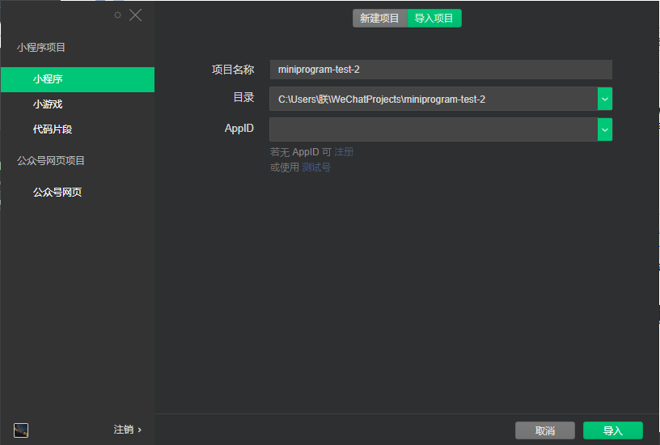

# min
##### 1、打开方式
- 我们应该使用微信开发者工具，进行项目的导入
> 
##### 2、小程序的代码构成
- 1、.json后缀的JSON配置文件
- 2、.wxml后缀的WXML模板文件
- 3、.wxss后缀的WXSS样式文件
- 4、.js后缀的JS脚本文件
##### 3、小程序配置
- app.json是当前小程序的全局配置，包括了小程序的所有页面路径、界面表现、网络超时时间、底部 tab 等。
- app.json 配置内容如下：
```
{
  "pages": ["pages/index/index", "pages/logs/logs"],
  "window": {
    "backgroundTextStyle": "light",
    "navigationBarBackgroundColor": "#fff",
    "navigationBarTitleText": "WeChat",
    "navigationBarTextStyle": "black"
  }
}
```
#### 4、页面配置 page.json
- 这里的 page.json 其实用来表示 pages/logs 目录下的 logs.json 这类和小程序页面相关的配置。

> 如果你整个小程序的风格是蓝色调，那么你可以在 app.json 里边声明顶部颜色是蓝色即可。实际情况可能不是这样，可能你小程序里边的每个页面都有不一样的色调来区分不同功能模块，因此我们提供了 page.json，让开发者可以独立定义每个页面的一些属性，例如刚刚说的顶部颜色、是否允许下拉刷新等等。
#### 5、WXML 模板
- 从事过网页编程的人知道，网页编程采用的是 HTML + CSS + JS 这样的组合，其中 HTML 是用来描述当前这个页面的结构，CSS 用来描述页面的样子，JS 通常是用来处理这个页面和用户的交互。
#### 6、WXSS 样式
- WXSS 具有 CSS 大部分的特性，小程序在 WXSS 也做了一些扩充和修改。
- 1）新增了尺寸单位。在写 CSS 样式时，开发者需要考虑到手机设备的屏幕会有不同的宽度和设备像素比，采用一些技巧来换算一些像素单位。WXSS 在底层支持新的尺寸单位 rpx ，开发者可以免去换算的烦恼，只要交给小程序底层来换算即可，由于换算采用的浮点数运算，所以运算结果会和预期结果有一点点偏差。
- 2）提供了全局的样式和局部样式。和前边 app.json, page.json 的概念相同，你可以写一个 app.wxss 作为全局样式，会作用于当前小程序的所有页面，局部页面样式 page.wxss 仅对当前页面生效。
- 3）此外 WXSS 仅支持部分 CSS 选择器
##### 7、JS 逻辑交互
- 一个服务仅仅只有界面展示是不够的，还需要和用户做交互：响应用户的点击、获取用户的位置等等。在小程序里边，我们就通过编写 JS 脚本文件来处理用户的操作。